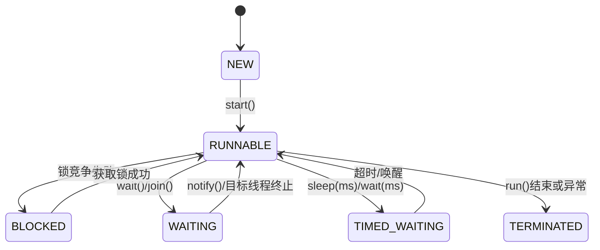

#### 一、线程的生命周期
##### 1）生命周期图

##### 2）生命周期详解
###### ①新建状态（NEW）
- ​**定义**：线程对象通过 `new` 关键字创建，但未调用 `start()` 方法启动
- ​**特点**：
    - 线程对象已分配内存，但未与操作系统线程关联。
    - 此时线程不可执行，需调用 `start()` 进入就绪状态。

######  ②可运行状态（`RUNNABLE`）
- **定义**：调用 `start()` 后，线程进入就绪队列，等待获取 CPU 时间片
- ​**子状态**：
    - ​**就绪（Ready）​**：等待 CPU 调度。
    - ​**运行（Running）​**：获取 CPU 时间片，执行 `run()` 方法。
- ​**触发条件**：
    - `start()` 启动线程。
    - 阻塞/等待状态解除（如锁释放、`notify()` 唤醒）

###### ③阻塞状态（BLOCKED）
- **定义**：线程因竞争锁失败而暂停，直到获取锁资源
- ​**触发场景**：
    - 尝试进入 `synchronized` 同步代码块或方法时，锁已被其他线程占用
- ​**恢复条件**：锁被释放，线程重新竞争锁并进入 `RUNNABLE`。

###### ④超时等待状态（TIMED_WAITING）
- **定义**：线程进入有限时间的等待，超时后自动恢复
- ​**触发方法**：
    - `Thread.sleep(long millis)`：休眠指定时间
    - `Object.wait(long timeout)`：带超时的等待
    - `LockSupport.parkNanos()`：基于时间的锁等待
- ​**恢复条件**：超时时间到达或外部唤醒。

###### ⑤终止状态（TERMINATED）
- **定义**：线程执行完毕或异常终止
- ​**触发条件**：
    - `run()` 方法正常结束。
    - 抛出未捕获异常（如 `InterruptedException`）。
    - 调用已废弃的 `stop()`（不推荐）

#### 二、线程创建方法

##### 1）继承 Thread 类
**原理**：自定义类继承 `Thread` 并重写 `run()` 方法。
```java
class MyThread extends Thread {
    @Override
    public void run() {
        System.out.println(Thread.currentThread().getName() + " 执行任务");
    }
}

public static void main(String[] args) {
    MyThread thread = new MyThread();
    thread.start();  // 启动线程[1,5](@ref)
}
```

**缺点**：Java 单继承限制，无法再继承其他类

##### 2）实现 Runnable 接口
**原理**：实现 `Runnable` 接口，将任务逻辑写在 `run()` 方法中。

```java
class MyRunnable implements Runnable {
    @Override
    public void run() {
        System.out.println(Thread.currentThread().getName() + " 执行任务");
    }
}

public static void main(String[] args) {
    Thread thread = new Thread(new MyRunnable());
    thread.start();  // 启动线程[1,2](@ref)
}
```

**优点**：避免单继承限制，任务与线程解耦

##### 3)匿名内部类/Lambad表达式

**简化写法**：适用于快速创建临时线程。
```java
// 匿名内部类
new Thread(new Runnable() {
    @Override
    public void run() {
        System.out.println("匿名类线程");
    }
}).start();

// Lambda 表达式
new Thread(() -> System.out.println("Lambda 线程")).start();
```

##### 4)实现Callable 接口
**原理**：通过 `Callable` 和 `Future` 获取线程执行结果。

```java
class MyCallable implements Callable<String> {
    @Override
    public String call() throws Exception {
        return "任务结果";
    }
}

public static void main(String[] args) throws Exception {
    FutureTask<String> futureTask = new FutureTask<>(new MyCallable());
    new Thread(futureTask).start();
    System.out.println(futureTask.get());  // 阻塞获取结果[4,5](@ref)
}
```

##### 5)线程池管理
**推荐方式**：通过 `ExecutorService` 管理线程生命周期。

```java
ExecutorService pool = Executors.newFixedThreadPool(5);
pool.execute(() -> System.out.println("线程池任务"));  // 提交任务
pool.shutdown();  // 关闭线程池[2,5](@ref)
```

#### Thread常用方法
##### 核心方法
```java
Thread thread = new Thread();

thread.start(); //启动线程，触发run()方法
thread.run(); //定义线程任务逻辑（需重写）
thread.sleep(2000); //使当前线程休眠指定毫秒
thread.join(); //终止当前线程，使thread执行完成以后再执行当前线程
thread.interrupt(); //中断线程（配置 InterruptedException处理）
if(thread.isAlive()){ ... } //检查线程是否存活

```

##### 线程属性控制
```java
Thread thread = new Thread();

thread.setName("Thread A"); //设置线程名称
thread.getName(); //获取线程名称
thread.setPriority(1); //设置优先级
thread.getPriority(); //获取优先级
thread.setDaemon(true); //设置为守护线程（后台线程，主线程终止时自动结束）

currentThread(); //获取当前线程实例
yield();  //提示调度器让出CPU（不保证立即生效）
```

##### 注意事项
中断处理： 通过interrupt() 标记中断状态，需在 run() 中检查 Thread.interrupted() 或捕获 InterruptedException

#### 最佳实践
[[Runnable 和 Callable]]：优先使用Runable 或 Callable:避免单继承限制，任务逻辑更清晰 
[[线程池 ThreadPool]] : 避免过度创建线程，优先使用线程池